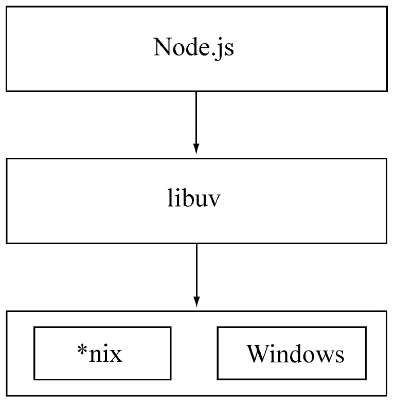

# Node


## Node 的诞生及发展
- 2009年5月，Ryan Dahl在GitHub上发布了最初的版本;
- 2011年11月，Node成为GitHub上关注度最高的项目;


## 名称及特点


### 名称由来

起初，Ryan Dahl（Node 之父）称他的项目为web.js，就是一个Web服务器，但是项目的发展超过了他最初单纯开发一个Web服务器的想法，变成了构建网络应用的一个**基础框架**，这样可以在它的基础上构建更多的东西，诸如服务器、客户端、命令行工具等。通过**通信协议**来组织许多Node，非常容易通过**扩展**来达成构建大型网络应用的目的。每一个Node进程都构成这个网络应用中的一个**节点**，这是它名字所含意义的真谛。


### 编程特点

作为后端JavaScript的运行平台，Node保留了前端浏览器JavaScript中那些熟悉的接口，没有改写语言本身的任何特性，依旧基于作用域和原型链，将前端中广泛运用的思想迁移到了服务器端。
1. 异步I/O
> 在Node中，我们可以从语言层面很自然地进行并行I/O操作。每个调用之间无须等待之前的I/O调用结束。在编程模型上可以极大提升效率。

在Node中，我们可以从语言层面很自然地进行并行I/O操作。每个调用之间无须等待之前的I/O调用结束。在编程模型上可以极大提升效率。下面的两个文件读取任务的耗时取决于最慢的那个文件读取的耗时：
```js
fs.readFile('/path1', function (err, file) { 
    console.log('读取文件1完成');
});

fs.readFile('/path2', function (err, file) { 
    console.log('读取文件2完成');
});
```
而对于同步I/O而言，它们的耗时是两个任务的耗时之和。这里异步带来的优势是显而易见的。

2. 事件与回调函数

3. 单线程
> Node采用了与Web Workers相同的思路来解决单线程中**大计算量**的问题：child_process。子进程的出现，意味着Node可以从容地应对单线程在健壮性和无法利用多核CPU方面的问题。通过将计算分发到各个子进程，可以将大量计算分解掉，然后再通过进程之间的事件消息来传递结果，这可以很好地保持应用模型的简单和低依赖。通过Master-Worker的管理方式，也可以很好地管理各个工作进程，以达到更高的健壮性。

4. 跨平台


通过良好的架构，Node的第三方C++模块也可以借助libuv实现跨平台。


## Node 的意义及应用


### 价值意义

JavaScript作为一门图灵完备的语言，长久以来却限制在浏览器的沙箱中运行，它的能力取决于浏览器中间层提供的支持有多少。


除了HTML、WebKit和显卡这些UI相关技术没有支持外，Node的结构与Chrome十分相似。它们都是**基于事件驱动的异步架构**，浏览器通过事件驱动来服务界面上的交互，Node通过事件驱动来服务I/O。在Node中，JavaScript可以随心所欲地访问本地文件，可以搭建WebSocket服务器端，可以连接数据库，可以如Web Workers一样玩转多进程。

Node打破了过去JavaScript只能在浏览器中运行的局面。**前后端编程环境统一**，可以大大降低前后端转换所需要的上下文交换代价。


### 应用场景

1. I/O密集型
I/O密集的优势主要在于Node利用事件循环的处理能力，而不是启动每一个线程为每一个请求服务，资源占用极少。（Nginx与Apache对比）

2. CPU密集型
解决办法：
- Node可以通过编写C/C++扩展的方式更高效地利用CPU，将一些V8不能做到性能极致的地方通过C/C++来实现；
- 通过子进程的方式，将一部分Node进程当做常驻服务进程用于计算，然后利用进程间的消息来传递结果，将计算与I/O分离，这样还能充分利用多CPU。

3. 分布式应用
分布式应用意味着对可伸缩性的要求非常高。

阿里巴巴的数据平台对Node的分布式应用算是一个典型的例子。数据平台通常要在一个数据库集群中去寻找需要的数据。阿里巴巴开发了**中间层**应用NodeFox、ITier，将数据库集群做了划分和映射，查询调用依旧是针对单张表进行SQL查询，中间层分解查询SQL，并行地去多台数据库中获取数据并合并。NodeFox能实现对多台MySQL数据库的查询，如同查询一台MySQL一样，而ITier更强大，查询多个数据库如同查询单个数据库一样，这里的多个数据库是指不同的数据库，如MySQL或其他的数据库。


### 实际使用

- 前后端编程语言环境统一。
这类倚重点的代表是雅虎。雅虎开放了Cocktail框架，利用自己深厚的前端沉淀，将YUI3这个前端框架的能力借助Node延伸到服务器端，使得使用者摆脱了日常工作中一边写JavaScript一边写PHP所带来的上下文交换负担。 

- Node带来的高性能I/O用于实时应用。
Voxer将Node应用在实时语音上。国内腾讯的朋友网将Node应用在长连接中，以提供实时功能，花瓣网、蘑菇街等公司通过socket.io实现实时通知的功能。 

- 并行I/O使得使用者可以更高效地利用分布式环境。
阿里巴巴和eBay是这方面的典型。阿里巴巴的NodeFox和eBay的ql.io都是借用Node并行I/O的能力，更高效地使用已有的数据。 

- 并行I/O，有效利用稳定接口提升Web渲染能力。
雪球财经和LinkedIn的移动版网站均是这种案例，撇弃同步等待式的顺序请求，大胆采用并行I/O，**加速数据的获取**进而提升Web的渲染速度。 

- 云计算平台提供Node支持。
微软将Node引入Azure的开发中，阿里云、百度均纷纷在云服务器上提供Node应用托管服务，Joyent更是云计算中提供Node支持的代表。这类平台**看重JavaScript带来的开发上的优势，以及低资源占用、高性能的特点**。 

- 游戏开发领域。
游戏领域对**实时和并发**有很高的要求，网易开源了pomelo实时框架，可以应用在游戏和高实时应用中。 

- 工具类应用。
过去依赖Java或其他语言构建的前端工具类应用，纷纷被一些前端工程师用Node重写，用前端熟悉的语言为前端构建熟悉的工具。


## CommonJS规范及npm包
Node通过模块规范，组织了自身的原生模块，弥补了JavaScript弱结构性问题，形成了稳定的结构，并向外提供服务。NPM通过对包规范的支持，有效地组织了第三方模块，这使得项目开发中的依赖问题得到很好的解决，并有效提供了分享和传播的平台，借助第三方开源力量，使得Node第三方模块的发展速度前所未有。


### CommonJS规范——实现node模块化，同步方式

1. 作为脚本语言出现的JavaScript早期缺陷：
- 没有模块系统。 
- 标准库较少。
ECMAScript仅定义了部分核心库，对于文件系统，I/O流等常见需求却没有标准的API。就HTML5的发展状况而言，W3C标准化在一定意义上是在推进这个过程，但是它仅限于浏览器端。 
- 没有标准接口。
在JavaScript中，几乎没有定义过如Web服务器或者数据库之类的标准统一接口。

2. Node 模块加载优先顺序：
- 优先从**缓存**加载——核心模块的缓存检查先于文件模块的缓存检查。
Node对引入过的模块都会进行缓存，以减少二次引入时的开销。与浏览器仅仅缓存文件相比，node缓存的是编译和执行之后的对象。
- 核心模块
如果试图加载一个与核心模块标识符相同的自定义模块，那是不会成功的。如果自己编写了一个http用户模块，想要加载成功，必须选择一个不同的标识符或者换用路径的方式。
- 路径形式的文件模块——相对路径或绝对路径
- 自定义模块——查找顺序：
1. 当前文件目录下的node_modules目录；
2. 父目录下的node_modules目录；
3. 沿路径向上主机递归，直到根目录下的node_modules目录。


### npm——node内置包管理器

对于Node而言，NPM帮助完成了第三方模块的发布、安装和依赖等。借助NPM，Node与第三方模块之间形成了很好的一个**生态系统**。

对于企业内部而言，私有的可重用模块可以打包到局域NPM仓库中，这样可以保持更新的**中心化**，不至于让各个小项目各自维护相同功能的模块，杜绝复制、粘贴实现代码共享的行为。


## 代码示例

1. 原生 node 实现简单 http 服务
```js
// 使用 Node 的核心模块http编码的 Hello World
const http = require('http')

const opts = {
    host: '127.0.0.1',
    port: 80,
}

const server = http.createServer((req, res) => {
    res.writeHead(200, {'Content-Type': 'text/plain'})
    res.end('Hello World\n')
})

server.listen(opts.port, opts.host, () => {
    console.log(`Server listening on: http://:${opts.host}:${opts.port}`)
})
```

2. 借用koa框架实现 http 服务及分发路由

Context 将 node 的 request 和 response 对象**封装**到单个对象中，为编写 Web 应用程序和 API 提供了许多有用的方法。 每个请求都将创建一个 Context，并在**中间**件中作为接收器引用，或者 ctx 标识符。

中间件在express及koa框架中起**核心作用**，koa框架采用“洋葱模型”，请求通过中间件逐层进行处理:

)

```js
// 使用 koa 框架及路由插件编码的 Hello World
const Koa = require('koa')
const Router = require('koa-router')

const opts = {
    host: '127.0.0.1',
    port: 80,
}

const app = new Koa()

const router = new Router({
    prefix: '/hello',
})

router
    .get('/world', (ctx, next) => { // 中间件函数
        ctx.response.type = 'text/html';
        ctx.response.body = '<h1>Hello World</h1>';
        next() // 传递到下一个中间件
    })

app.use(router.routes())
    .use(router.allowedMethods())

app.listen(opts.port, opts.host, () => {
    console.log(`Server listening on: http://:${opts.host}:${opts.port}`)
})
```

> reference:
1. 《Node即学即用》———— 深入浅出，适宜入门  推荐级别：*****
2. 《Node in Action》———— 技术前沿，扩充知识  推荐级别：***
3. 《深入浅出NodeJs》———— 深层原理，透彻学习  推荐级别：****